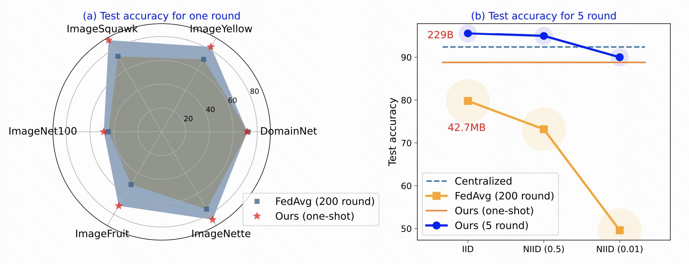

# Abstract 
Existing federated learning solutions focus on transmitting training data or model weights/gradients between clients and server, which suffers from serious low-efficiency and privacy-leakage problems.Thanks to the emerging language/vision foundation models, we propose a novel federated learning framework that transmits prompts associated with distributed knowledge based on shared foundation models. The informative training data can be synthesized remotely based on received prompts and shared foundation models containing little privacy. The new framework offers numerous advantages, including improved communication efficiency, robustness to distribution shift, significant performance improvement and better privacy protection. Extensive experiments on ImageNet and DomainNet datasets demonstrates remarkable capabilities of the new framework over previous solutions.


# Datasets

In order to adequately simulate scenarios of label distribution skew and feature distribution skew, extensive experiments were conducted on subsets of `ImageNet` and `DomainNet` datasets. The specific construction methods and descriptions of the subsets are presented as follows (for more details, please refer to `helpers/dataset.py`).

| Dataset | Description| #Class | Class name | Class id |
| --- | --- | --- | --- | --- |
| ImageNette | 10 classes from ImageNet1k | 10 | ("tench", "English springer", "cassette player", "chain saw", "church", "French horn", "garbage truck", "gas pump", "golf ball", "parachute") | [0, 217, 482, 491, 497, 566, 569, 571, 574, 701] |
| ImageFruit | 10 classes from ImageNet1k | 10 | ("pineapple", "banana", "strawberry", "orange", "lemon", "pomegranate", "fig", "bell_pepper", "cucumber", "green_apple") | [953, 954, 949, 950, 951, 957, 952, 945, 943, 948] |
| ImageYellow | 10 classes from ImageNet1k | 10 | ("bee", "ladys slipper", "banana", "lemon", "corn", "school_bus", "honeycomb", "lion", "garden_spider", "goldfinch") | [309, 986, 954, 951, 987, 779, 599, 291, 72, 11] |
| ImageSquawk | 10 classes from ImageNet1k | 10 | ("peacock", "flamingo", "macaw", "pelican", "king_penguin", "bald_eagle", "toucan", "ostrich", "black_swan", "cockatoo") | [84, 130, 88, 144, 145, 22, 96, 9, 100, 89] |
| ImageNet-100 | 100 classes from ImageNet1k | 100 | -- | -- |


# Requirements
- You can set up the environment using the command below.
```
conda env create -f environment.yaml
conda activate fgl
```

# Reproducing

## For Our Method
### Data Generation at Server
We investigate two types of prompt generation strategies: `class-level prompt` and `instance-level prompt`. The class-level prompts are generated based on the class names, providing high-level guidance to the generative model.  The instance-level prompt strategy leverages prompts that are tailored for individual instances in the private dataset, which are more informative for training models.

For class-level prompt, run the following command:
```bash
sh scripts/data_generation/class_level.sh $dataset $exp_name $gpu_id
```

For instance-level prompt, run the following command:
```bash
sh scripts/data_generation/instance_level.sh  $raw_data_dir $syn_data_dir $save_prompt_dir $gpu_id
```

### One-Shot FL
Run the following command:
```bash
sh ./scripts/one-shot/fgl.sh  $net $dataset $exp_name $syn $blip $data_path_train $data_path_test $gpu_id

# net:choices ['holocron_resnet18', 'holocron_resnet34', 'holocron_resnet50']
# dataset:choices ["imagenet100", "imagenette", "imagefruit", "imageyellow", "imagesquawk", "domainnet"]
# syn:choices [0, 1]
# blip:choices [0, 1]
```

### 5-round FL
- with finetuning on server
```bash
sh scripts/multi-round/five_round_fgl_sever_finetune.sh $net $dataset $exp_name $data_path_train  $data_path_test $net_path $partition $beta $data_path_server $gpu_id
# net:choices ['holocron_resnet18', 'holocron_resnet34', 'holocron_resnet50']
# dataset:choices ["imagenet100", "imagenette", "imagefruit", "imageyellow", "imagesquawk", "domainnet"]
# partition choices [iid, dirichlet]
# beta:choices [0.5, 1]
```

- without finetuning on server
```bash
sh scripts/multi-round/five_round_fgl.sh $net $dataset $exp_name $data_path_train  $data_path_test $net_path $partition $beta $gpu_id
# net:choices ['holocron_resnet18', 'holocron_resnet34', 'holocron_resnet50']
# dataset:choices ["imagenet100", "imagenette", "imagefruit", "imageyellow", "imagesquawk", "domainnet"]
# partition choices [iid, dirichlet]
# beta:choices [0.5, 1]
```

## For Baseline
- FedAvg. Please run the following command:

```bash
sh scripts/multi-round/fedavg.sh $net $dataset $exp_name  $data_path_train  $data_path_test $partition $beta $gpu_id
# net:choices ['holocron_resnet18', 'holocron_resnet34', 'holocron_resnet50']
# dataset:choices ["imagenet100", "imagenette", "imagefruit", "imageyellow", "imagesquawk", "domainnet"]
# partition choices [iid, dirichlet]
# beta:choices [0.5, 1]
```

- Centralized Training. Please run the following command:
```bash
sh scripts/centralized/central.sh $net $dataset $exp_name $data_path_train  $data_path_test $gpu_id
# net:choices ['holocron_resnet18', 'holocron_resnet34', 'holocron_resnet50']
# dataset:choices ["imagenet100", "imagenette", "imagefruit", "imageyellow", "imagesquawk", "domainnet"]

```
# Examples
Here you can see the final results:


Here are some visualization examples:
- For Imagenet subset:

- For DomainNet:


# Citation
```
@misc{zhang2023federated,
      title={Federated Generative Learning with Foundation Models}, 
      author={Jie Zhang and Xiaohua Qi and Bo Zhao},
      year={2023},
      eprint={2306.16064},
      archivePrefix={arXiv},
      primaryClass={cs.LG}
}
```
